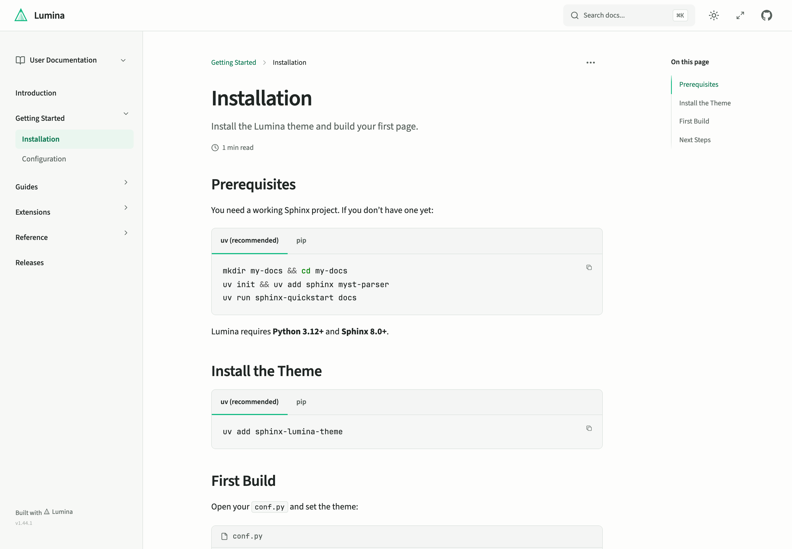

# Sphinx Lumina Theme

[](https://pypi.org/project/sphinx-lumina-theme/)
[](https://github.com/r4sky0/sphinx-lumina-theme/blob/main/LICENSE)
[](https://r4sky0.github.io/sphinx-lumina-theme/)

A crisp, responsive Sphinx theme with readable typography, dark mode, and instant search. Self-hosted fonts, minimal setup, no external CDN calls.

<a href="https://r4sky0.github.io/sphinx-lumina-theme/">
  <picture>
    <source media="(prefers-color-scheme: dark)" srcset="docs/assets/readme-dark.png">
    
  </picture>
</a>

[Live demo & documentation](https://r4sky0.github.io/sphinx-lumina-theme/) · [Configuration](https://r4sky0.github.io/sphinx-lumina-theme/getting-started/configuration.html) · [Contributing](https://r4sky0.github.io/sphinx-lumina-theme/contributing/)

## Features

- **Light and dark modes** with a system-aware toggle.
- **Instant search** powered by Pagefind, with `⌘K` / `Ctrl+K` access.
- **Responsive navigation** with section and version switchers, a collapsible sidebar, and a mobile page outline.
- **Rich content** with MyST Markdown, syntax highlighting, and one-click code copying.
- **Interactive API docs** with OpenAPI support, request panels, and curl copying.
- **Customizable branding** through `conf.py`: colors, logos, navigation, and social links.

## Quick Start

Requires **Python 3.12+** and **Sphinx 8.0+**. Pagefind search also needs
Node.js so the build can create its search index.

```bash
pip install sphinx-lumina-theme
```

Using uv? Run `uv add sphinx-lumina-theme` instead.

Set the theme in your `conf.py`:

```python
html_theme = "lumina"
```

Build your docs:

```bash
sphinx-build docs docs/_build/html
```

With uv, prefix the build command with `uv run`. Open `docs/_build/html/index.html` to view the result.

New to Sphinx? Start with the [installation guide](https://r4sky0.github.io/sphinx-lumina-theme/getting-started/installation.html), including project creation and MyST setup.

Upgrading from 1.x? Review the [Lumina 2 migration notes](https://r4sky0.github.io/sphinx-lumina-theme/guides/custom-styling.html#migrating-to-lumina-2) if you use custom CSS or templates.

## Contributing

See the [contributing guide](https://r4sky0.github.io/sphinx-lumina-theme/contributing/) for local setup, asset builds, and tests. Bug reports and pull requests are welcome.

## License

[Apache-2.0](LICENSE)
